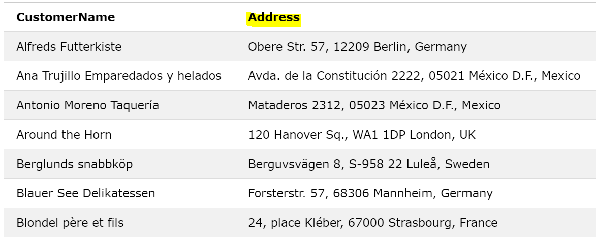
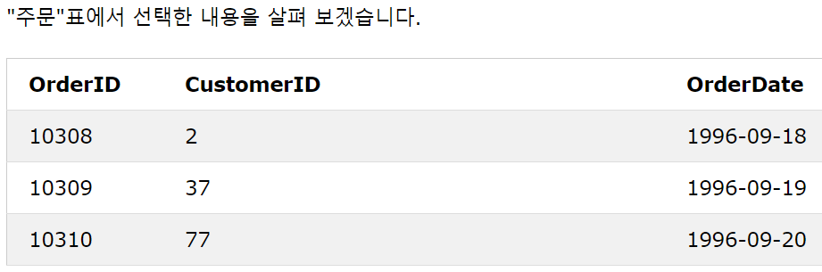
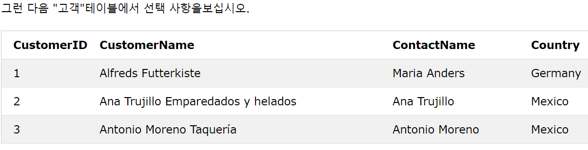
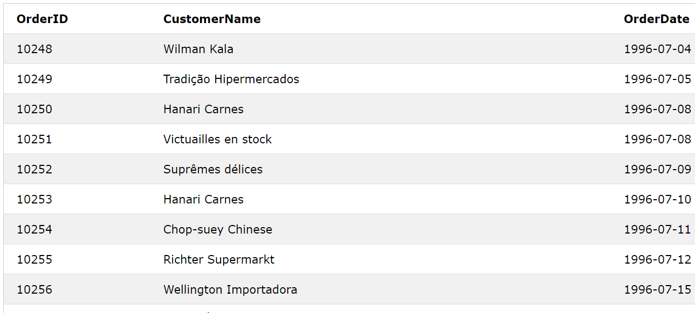
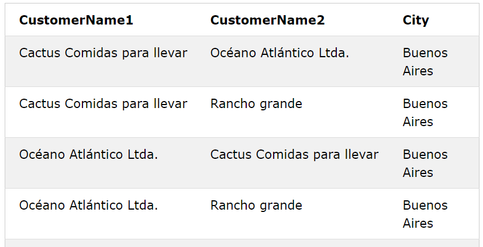

## SQL Aliases(별칭)
* SQL 별명은 테이블 또는 테이블의 열에 임시 이름을 제공하는 데 사용
* 별명은 종종 열 이름을 더 읽기 쉽게 만드는 데 사용
* 별칭은 쿼리 기간 동안 만 존재
    * 열 구문 : SELECT 컬럼명 AS 임시이름 FROM 테이블명;
    * 테이블 구문 : SELECT 컬럼명 FROM 테이블명 AS 임시이름;
    
* 열 ALiases 예시
    * CustomerID 열과 CustomerName 열에 대한 두 개의 별칭
        * SELECT CustomerID AS ID, CustomerName AS Customer FROM Customers;
    * CustomerName 열과 ContactName 열에 대한 두 개의 별칭
        * SELECT CustomerName AS Customer, ContactName AS [Contact Person] FROM Customers;
    * 네 개의 열 (주소, 우편 번호, 도시 및 국가)을 결합하는 "주소"라는 별칭
        * SELECT CustomerName, Address + ', ' + PostalCode + ' ' + City + ', ' + Country AS Address FROM Customers;
         
    
* 테이블 ALiases 예시
      * CustomerID = 4 (Around the Horn) 인 고객의 모든 주문을 선택합니다.
         * "Customers"및 "Orders"테이블을 사용하고 각각 "c"및 "o"의 테이블 별칭을 지정
            * SELECT o.OrderID, o.OrderDate, c.CustomerName FROM Customers AS c, Orders AS o WHERE c.CustomerName="Around the Horn" AND c.CustomerID=o.CustomerID;
            
           
## SQL JOIN 
* 둘 사이의 관련 열을 기반으로 둘 이상의 테이블의 행을 결합하는데 사용

* JOIN 예시

      * "주문"테이블의 "고객 ID"열은 "고객"테이블의 "고객 ID"를 나타냄. 두 테이블 간의 관계는 "CustomerID"열. 그런 다음 두 테이블에서 값이 일치하는 레코드를 선택하는 다음 SQL 문 (INNER JOIN이 포함됨)을 작성
            * SELECT Orders.OrderID, Customers.CustomerName, Orders.OrderDate FROM Orders INNER JOIN Customers ON Orders.CustomerID=Customers.CustomerID;
               
            
* 다른 유형의 JOIN
   * (INNER) JOIN : 두 테이블에서 일치하는 값을 가진 레코드를 리턴
   * LEFT (OUTER) JOIN : 왼쪽 테이블의 모든 레코드와 오른쪽 테이블의 일치하는 레코드를 반환
   * RIGHT (OUTER) JOIN : 오른쪽 테이블의 모든 레코드와 왼쪽 테이블의 일치하는 레코드를 반환
   * FULL (OUTER) JOIN : 왼쪽 또는 오른쪽 테이블에 일치하는 모든 레코드를 반환
        
   
  
## SQL INNER JOIN 키워드
* 두 테이블 모두에서 값이 일치하는 레코드를 선택
   * 구문 : SELECT 컬럼명 FROM 테이블명1 INNER JOIN 테이블2 ON 테이블1.컬럼명 = 테이블2.컬럼명;
        
   
 * INNER JOIN 예시
   * 고객 정보가있는 모든 주문을 선택 
      * SELECT Orders.OrderID, Customers.CustomerName FROM Orders INNER JOIN Customers ON Orders.CustomerID = Customers.CustomerID;
   * 고객 및 배송 업체 정보가 포함 된 모든 주문을 선택
      * SELECT Orders.OrderID, Customers.CustomerName, Shippers.ShipperName FROM ((Orders INNER JOIN Customers ON Orders.CustomerID = Customers.CustomerID) INNER JOIN Shippers ON Orders.ShipperID = Shippers.ShipperID);
      
      
## SQL LEFT JOIN 키워드
* 왼쪽 테이블 (table1)의 모든 레코드와 오른쪽 테이블 (table2)의 일치 된 레코드를 반환, 일치하는 것이 없으면 결과는 오른쪽에서 NULL
   * 구문 : SELECT 컬럼명 FROM 테이블명1 LEFT JOIN 테이블명2 ON 테이블명1.컬럼명 = 테이블2.컬럼명
        
   
* LEFT JOIN 예시
   * 모든 고객과 고객이 가질 수있는 모든 주문을 선택
      * SELECT Customers.CustomerName, Orders.OrderID FROM Customers LEFT JOIN Orders ON Customers.CustomerID = Orders.CustomerID ORDER BY Customers.CustomerName;
      
      
## SQL RIGHT JOIN 키워드
* 오른쪽 테이블 (table2)의 모든 레코드와 왼쪽 테이블 (table1)의 일치 된 레코드를 반환. 일치하는 항목이 없으면 왼쪽부터 결과는 NULL
   * 구문 : SELECT 컬럼명 FROM 테이블명1 RIGHT JOIN 테이블명2 ON 테이블명1.컬럼명=테이블명2.컬럼명;
       
   
* RIGHT JOIN 예시
   * 모든 직원과 그들이 주문한 모든 주문을 반환
      * SELECT Orders.OrderID, Employees.LastName, Employees.FirstName FROM Orders RIGHT JOIN Employees ON Orders.EmployeeID = Employees.EmployeeID ORDER BY Orders.OrderID;
      
      
## SQL FULL OUTER JOIN 키워드
* 왼쪽 (table1) 또는 오른쪽 (table2) 테이블 레코드와 일치하는 경우 모든 레코드를 리턴
   * 구문 : SELECT 컬럼명 FROM 테이블명1 FULL OUTER JOIN 테이블명2 ON 테이블명1.컬럼명 = 테이블명2.컬럼명 WHERE 조건;
          
   
 * FULL OUTER JOIN 예시
   * 모든 고객과 모든 주문을 선택
      * SELECT Customers.CustomerName, Orders.OrderID FROM Customers FULL OUTER JOIN Orders ON Customers.CustomerID=Orders.CustomerID ORDER BY Customers.CustomerName;
      
      
## SQL Self JOIN
* 일반 조인이지만 테이블은 자체 조인
   * 구문 : SELECT 컬럼명 FROM 테이블명1,테이블명2 WHERE 조건 ;
   
* 예시
   * 같은 도시의 고객과 일치
      * SELECT A.CustomerName AS CustomerName1, B.CustomerName AS CustomerName2, A.City FROM Customers A, Customers B WHERE A.CustomerID <> B.CustomerID AND A.City = B.City ORDER BY A.City;
      
      

## SQL UNION 연산자 
* 둘 이상의 SELECT 문의 결과 집합을 결합하는 데 사용
* UNION 내의 각 SELECT 문은 동일한 수의 열을 가져야함
* 열의 데이터 형식도 비슷해야함
* 각 SELECT 문의 열 순서도 동일해야함
   * UNION 구문 : SELECT 컬럼명 FROM 테이블명1 UNION SELECT 컬럼명 FROM 테이블명2;
   * UMION ALL 구문 : SELECT 컬럼명 FROM 테이블명1 UNION ALL SELECT 컬럼명 FROM 테이블명2;
   
* 예시
   * "Customers"및 "Suppliers"테이블에서 도시 (고유 한 값만)를 반환
      * SELECT City FROM Customers UNION SELECT City FROM Suppliers ORDER BY City;
   * "Customers"및 "Suppliers"테이블 모두에서 도시 (중복 값도)를 반환
      * SELECT City FROM Customers UNION ALL SELECT City FROM Suppliers ORDER BY City;
   

## SQL GROUP BY 문
* "각 국가의 고객 수 찾기"와 같이 같은 값을 가진 행을 요약 행으로 그룹화
* 종종 집계 함수 (COUNT, MAX, MIN, SUM, AVG)와 함께 사용되어 결과 집합을 하나 이상의 열로 그룹화
   * 구문 : SELECT 컬럼명 FROM 테이블명 WHERE 조건 GROUP BY 컬럼명 ORDER BY 컬럼명;
   
* GROUP BY 예시 
   * 각 국가의 고객 수
      * SELECT COUNT(CustomerID), Country FROM Customers GROUP BY Country;
   * 각 국가의 고객 수를 나열
      * SELECT COUNT(CustomerID), Country FROM Customers GROUP BY Country ORDER BY COUNT(CustomerID) DESC;
      
* JOIN을 사용한 GROUP BY 예시
   * 각 배송 업체에서 발송 한 주문 수
      * SELECT Shippers.ShipperName, COUNT(Orders.OrderID) AS NumberOfOrders FROM Orders LEFT JOIN Shippers ON Orders.ShipperID = Shippers.ShipperID GROUP BY ShipperName;
      
      
## SQL HAVING 절
* WHERE 키워드를 집계 함수와 함께 사용할 수 없으므로 HAVING 절이 SQL에 추가
   * 구문 : SELECT 컬럼명 FROM 테이블명 WHERE 조건 GROUP BY 컬럼명 HAVING 조건 ORDER BY 컬럼명;
  
* 예시 
   * 각 국가의 고객 수를 나타냅니다. 고객이 5 명 이상인 국가 만 포함
      * SELECT COUNT(CustomerID), Country FROM Customers GROUP BY Country HAVING COUNT(CustomerID) > 5;
   * 각 국가의 고객 수를 목록으로 표시합니다. 고객 수가 5 명 이상인 국가 만 포함
      * SELECT COUNT(CustomerID), Country FROM Customers GROUP BY Country HAVING COUNT(CustomerID) > 5 ORDER BY COUNT(CustomerID) DESC;
      
      
## SQL EXISTS 연산자
* 서브 쿼리에 레코드가 있는지 테스트하는데 사용
* 부속 조회가 하나 이상의 레코드를 리턴하면 EXISTS 연산자는 true를 리턴
   * 구문 : SELECT 컬럼명 FROM 테이블명 WHERE EXISTS (SELECT 컬럼명 FROM 테이블명 WHERE 조건);
